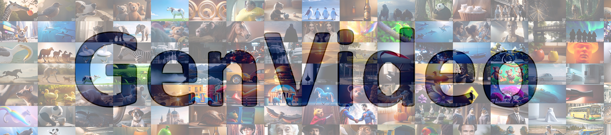
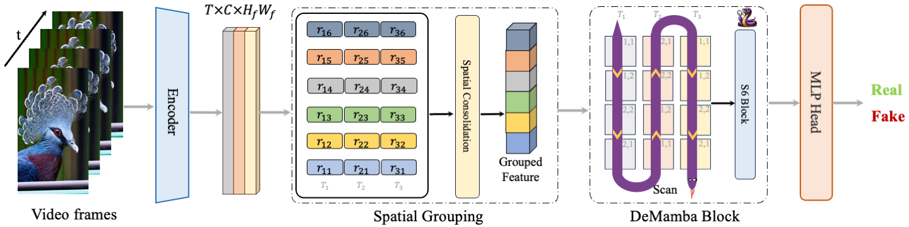

This is the official code of paper 'DeMamba: AI-Generated Video Detection on Million-Scale GenVideo Benchmark'.

## :boom: News!!! 
- (24.12.11) We are pleased to announce that our AI-generated content (AIGC) video detection model, developed based on GenVideo, has passed the evaluation by the China Academy of Information and Communications Technology (CAICT) and achieved the highest rating, making us the first organization in China to be officially registered and approved.[[certificate](https://github.com/chenhaoxing/DeMamba/blob/main/figs/xty.jpg)][[report](https://mp.weixin.qq.com/s/OoW7EI1QoSrQ3FIftfbudg)]


## :dart: Todo

- [x] Release source code.
- [x] Release dataset. 


## :file_folder: Dataset download


### Data preparation process
 - Download the original videos.
   
   - Generated videos: all generated videos can download at [https://modelscope.cn/datasets/cccnju/Gen-Video](https://modelscope.cn/datasets/cccnju/Gen-Video).
     
   - Real videos: The data from the MSRVTT dataset is contained within the GenVideo-Val.zip file. We also provided the selected Youku videos in previous link . For Kinetics-400, you will need to download it yourself at [https://github.com/cvdfoundation/kinetics-dataset](https://github.com/cvdfoundation/kinetics-dataset).
     
 - Preprocess the video and get the data list csv file.

Statistics of real and generated videos in the GenVideo dataset:
| **Video Source**                                    | **Type** | **Task** | **Time** | **Resolution** | **FPS** | **Length** | **Training Set** | **Testing Set** |
|-----------------------------------------------------|----------|----------|----------|----------------|---------|------------|------------------|----------------|
| Kinetics-400               | Real     | -        | 17.05    | 224-340        | -       | 5-10s      | 260,232          | -              |
| Youku-mPLUG                     | Real     | -        | 23.07    | -              | -       | 10-120s    | 953,279          | -             |
| MSR-VTT                           | Real     | -        | 16.05    | -              | -       | 10-30s     | -                | 10,000         |
| ZeroScope                       | Fake     | T2V      | 23.07    | 1024×576       | 8       | 3s         | 133,169          | -             |
| I2VGen-XL                         | Fake     | I2V      | 23.12    | 1280×720       | 8       | 2s         | 61,975           | -            |
| SVD                     | Fake     | I2V      | 23.12    | 1024×576       | 8       | 4s         | 149,026          | -              | 
| VideoCrafte          | Fake     | T2V      | 24.01    | 1024×576       | 8       | 2s         | 39,485           | -              | 
| Pika                                   | Fake     | T2V&I2V  | 24.02    | 1088×640       | 24      | 3s         | 98,377           |        |
| DynamiCrafter         | Fake     | I2V      | 24.03    | 1024×576       | 8       | 3s         | 46,205          | -              | 
| SD                             | Fake     | T2V&I2V  | 23-24    | 512-1024       | 8       | 2-6s       | 200,720          | -              |                 
| SEINE                         | Fake     | I2V      | 24.04    | 1024×576       | 8       | 2-4s       | 24,737            | -              |                 
| Latte                           | Fake     | T2V      | 24.03    | 512×512        | 8       | 2s         | 149,979          | -              |                 
| OpenSora                           | Fake     | T2V      | 24.03    | 512×512        | 8       | 2s         | 177,410          | -              |                 
| ModelScope               | Fake     | T2V      | 23.03    | 256×256        | 8       | 4s         | -                | 700            |
| MorphStudio                     | Fake     | T2V      | 23.08    | 1280×720       | 8       | 2s         | -                | 700            |                 
| MoonValley                       | Fake     | T2V      | 24.01    | 1024×576       | 16      | 3s         | -                | 626            |                 
| HotShot                           | Fake     | T2V      | 23.10    | 672×384        | 8       | 1s         | -                | 700            |                 
| Show_1                       | Fake     | T2V      | 23.10    | 576×320        | 8       | 4s         | -                | 700            |                 
| Gen2                     | Fake     | I2V&T2V  | 23.09    | 896×512        | 24      | 4s         | -                | 1,380          |                 
| Crafter               | Fake     | T2V      | 23.04    | 256×256        | 8       | 4s         | -                | 1,400          |                 
| Lavie                                 | Fake     | T2V      | 23.09    | 1280×2048      | 8       | 2s         | -                | 1,400          |                 
| Sora                                 | Fake     | T2V      | 24.02    | -              | -       | -60s       | -                | 56             |                
| WildScrape                                          | Fake     | T2V&I2V  | 24       | 512-1024       | 8-16    | 2-6s       | -                | 926            |
| **Total Count**                                     | -        | -        | -        | -              | -       | -          | 2,294,594       | 19,588         | 

## :snake: Detail Mamba (DeMamba)


<p align="center"><em>In memory of Kobe Bryant (generated by GPT-4o)</em></p>

> "Determination wins games, but Detail wins championships." — *Kobe Bryant, in his Show Detail, 2018*


<p align="center"><em>The overall framework of our Detail Mamba (DeMamba)</em></p>


## :space_invader: Citing GenVideo&DeMamba
If you use GenVideo or DeMamba in your research or use the codebase here, please use the following BibTeX entry.

```BibTeX
@article{DeMamba,
      title={DeMamba: AI-Generated Video Detection on Million-Scale GenVideo Benchmark},
      author={Haoxing Chen and Yan Hong and Zizheng Huang and Zhuoer Xu and Zhangxuan Gu and Yaohui Li and Jun Lan and Huijia Zhu and Jianfu Zhang and Weiqiang Wang and Huaxiong Li},
      journal={arXiv preprint arXiv:2405.19707},
      year={2024}
}
```

## Star History

[](https://star-history.com/#chenhaoxing/DeMamba&Date)

## Acknowledgement
Many thanks to the nice work of [STIL](https://github.com/wizyoung/STIL-DeepFake-Video-Detection), [CLIP](https://github.com/openai/CLIP), [XCLIP](https://github.com/microsoft/VideoX/tree/master/X-CLIP), [NPR](https://github.com/chuangchuangtan/NPR-DeepfakeDetection/tree/main) and [VideoMAE](https://github.com/MCG-NJU/VideoMAE-Action-Detection). 

## :email: Contact
If you have any questions, feel free to contact us: hx.chen@hotmail.com.


